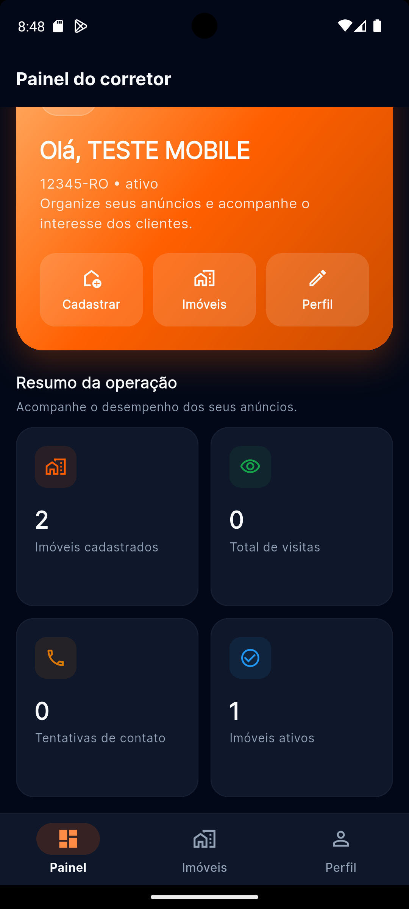
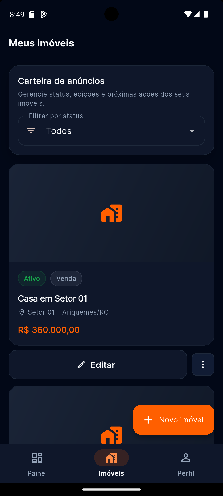
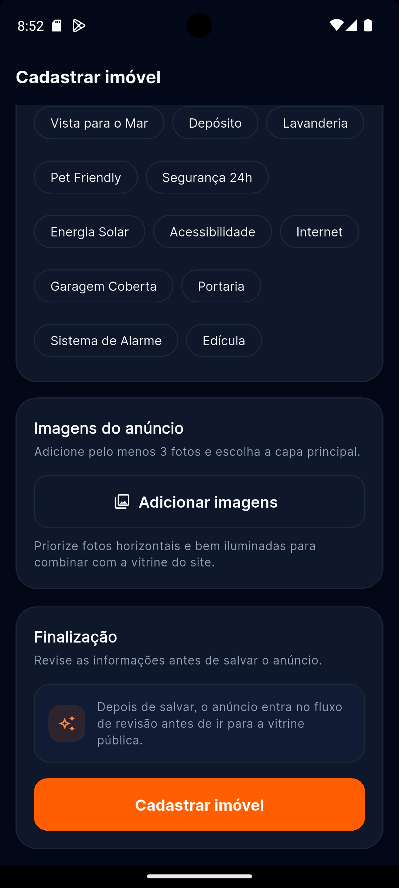

# Ymobiliario Corretor App

Aplicativo Flutter para corretores de imóveis dentro do ecossistema Ymobiliario. O app permite autenticação, gestão de perfil e cadastro/listagem/edição de imóveis integrados ao backend do marketplace.

## Descrição

O problema resolvido pelo app é a centralização da operação do corretor em uma interface mobile. Em vez de depender apenas do painel web, o corretor consegue acessar sua conta, acompanhar seus anúncios e cadastrar novos imóveis pelo celular.

## Público-alvo

- Corretores de imóveis que anunciam no marketplace Ymobiliario
- Equipes comerciais que precisam cadastrar e atualizar imóveis em campo

## Funcionalidades principais

- Login do corretor com persistência de sessão
- Recuperação e redefinição de senha
- Dashboard inicial
- Listagem dos imóveis do corretor
- Cadastro e edição de imóveis
- Upload de imagens
- Visualização de detalhes do imóvel
- Edição de perfil
- Alteração de senha

## Tecnologias utilizadas

- Flutter
- Dart
- `flutter_riverpod`
- `go_router`
- `dio`
- `image_picker`
- Backend REST próprio do projeto Ymobiliario

## Arquitetura

O app usa uma arquitetura modular por features, com separação entre camadas de interface, regras de fluxo e comunicação com API.

Estrutura principal:

```text
lib/
├── app/            # Bootstrap da aplicação, tema e rotas
├── core/           # Configuração, API client e session manager
├── features/       # Módulos por funcionalidade
│   ├── auth/       # Login, registro e recuperação de senha
│   ├── dashboard/  # Tela inicial do corretor
│   ├── profile/    # Perfil e alteração de senha
│   └── properties/ # Cadastro, listagem, detalhe e edição de imóveis
├── models/         # Modelos de dados
├── services/       # Serviços de integração com o backend
└── widgets/        # Componentes reutilizáveis
```

Essa organização facilita manutenção, evolução das telas e isolamento das responsabilidades.

## Backend utilizado

O aplicativo consome a API REST do projeto Ymobiliario, responsável por:

- autenticação do corretor
- leitura e atualização de perfil
- recuperação de senha
- cadastro, edição e listagem de imóveis
- upload e leitura de imagens

A URL base da API é definida em `lib/core/config.dart`.

| Ambiente | URL |
|---|---|
| Android Emulator | `http://10.0.2.2:3001` |
| iOS Simulator | `http://localhost:3001` |
| Device físico | ajustar para o IP da máquina na rede local |

## Gerenciador de estados

O projeto utiliza `flutter_riverpod`.

O Riverpod foi aplicado principalmente para:

- controle do estado de autenticação
- restauração de sessão
- atualização reativa do usuário logado
- controle de loading e erro nos fluxos principais

Exemplo central: `authControllerProvider`, responsável por inicialização da sessão, login, logout e refresh do perfil.

## Uso de IA no desenvolvimento

O desenvolvimento contou com apoio de IA para acelerar etapas como:

- organização da arquitetura inicial
- criação e refino de telas Flutter
- integração com endpoints do backend
- correção de bugs
- melhoria visual das telas
- revisão de fluxos e documentação

A IA foi utilizada como ferramenta de apoio. As decisões de implementação, validação e adaptação ao projeto foram conduzidas manualmente durante o desenvolvimento.

## Pré-requisitos

- Flutter SDK compatível com o projeto
- Backend do Ymobiliario rodando localmente
- Android Studio ou outro ambiente com emulador/dispositivo configurado

## Como executar

```bash
flutter pub get
flutter run
```

## Testes

```bash
flutter test
flutter test integration_test/
```

## Usuário de teste validado

| Email | Senha | Perfil |
|---|---|---|
| `teste.corretor@ymobiliario.local` | `senha1234` | Corretor |

## Regras de negócio do cadastro de imóvel

- mínimo de 3 imagens
- imagens JPG, PNG ou WEBP
- máximo de 20 imagens
- CEP válido de Rondônia
- descrição com no mínimo 20 caracteres
- preço obrigatório para venda
- `valorAluguel` obrigatório para aluguel
- `valorArrendamento` obrigatório para arrendamento rural
- tipos suportados: Residencial, Rural, Terreno, Comercial e Industrial

Subtipos:

- Residencial: Casa, Apartamento, Cobertura, Kitnet, Loft, Sobrado
- Rural: Chacara, Sitio, Fazenda
- Terreno: Terreno
- Comercial: Sala Comercial, Predio Comercial
- Industrial: Galpao

## Telas do aplicativo

### Painel do Corretor
Tela inicial com resumo da operação: imóveis cadastrados, visitas, tentativas de contato e imóveis ativos. Acesso rápido para cadastrar imóveis, ver lista e editar perfil.



### Meus Imóveis
Listagem dos imóveis do corretor com filtro por status, informações de cada anúncio (tipo, localização, valor) e botões de edição. Inclui botão "Novo imóvel" para cadastro rápido.



### Meu Perfil
Visualização do perfil do corretor com CRECI, email e opções para editar perfil, alterar senha e sair da conta.


### Editar Perfil
Formulário de edição com campos para foto, nome fantasia, telefone, descrição, Instagram e Facebook.


### Cadastrar Imóvel
Formulário de cadastro de novo anúncio imobiliário com etapas para identidade do imóvel (tipo, subtipo, disponibilidade), descrição, localização e valores.


### Cadastrar Imóvel - Etapa 2
Seleção de comodidades (vista para o mar, depósito, lavanderia, pet friendly, etc.), upload de imagens do anúncio e finalização com revisão antes de enviar para aprovação.



## Status do projeto

O app está funcional para o fluxo principal do corretor, com integração real ao backend. O empacotamento final em APK/App Bundle e automação de build ficam como próxima etapa do processo.
